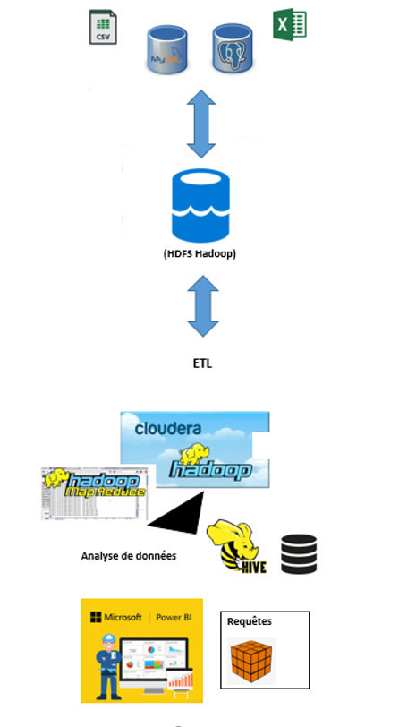

# BigData_CHU

## Contexte

Un centre hospitalier universitaire (CHU) doit revoir son architecture Cloud et mettre à jour son infrastructure big data.
Comment donc restructurer et modéliser les données du CHU?
- Quels outils ?
- Quel environnement ?
- Quelle architecture ?

## Contraintes

- Responsabilités
- Volume de données
- Format de fichiers/données
- Schéma d’architecture du stagiaire existante
- Environnement médical

 
 Schèma de l'architecture existante 

## Solution
