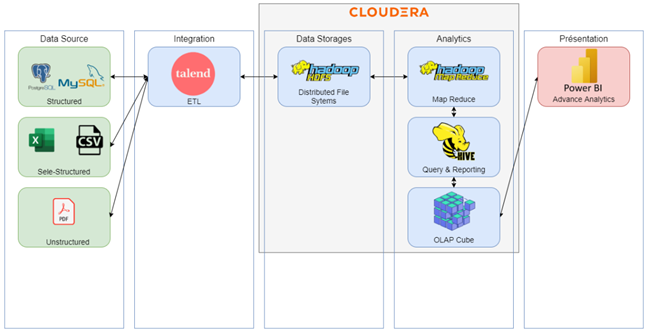
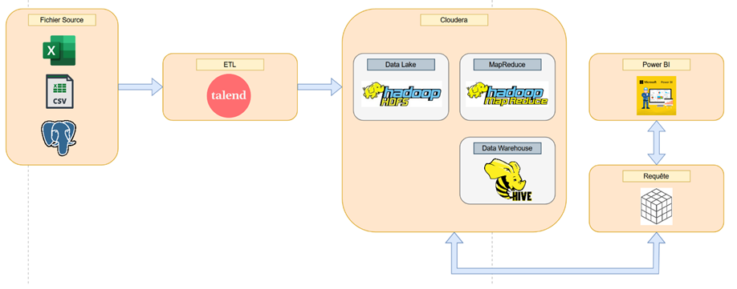
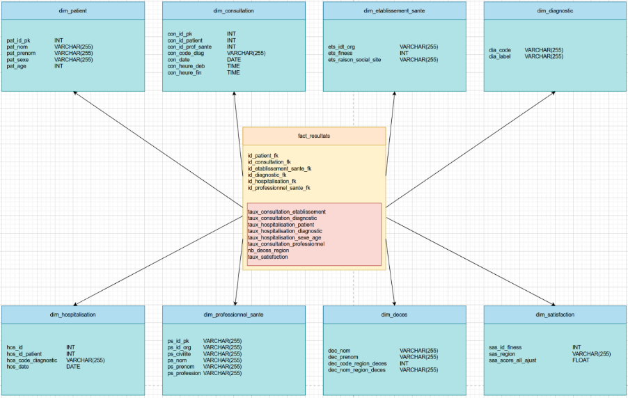
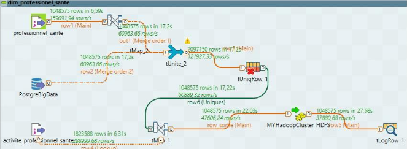

# BigData_CHU

## Contexte

Un centre hospitalier universitaire (CHU) doit revoir son architecture Cloud et mettre à jour son infrastructure big data.
Comment donc restructurer et modéliser les données du CHU?
- Quels outils ?
- Quel environnement ?
- Quelle architecture ?

## Contraintes

- Responsabilités
- Volume de données
- Format de fichiers/données
- Schéma d’architecture du stagiaire existante
- Environnement médical (maximum 1 heure de période hors-service)

 
   <em> Schèma de l'architecture existante </em>

## Solution

 
   <em> Solutions technologiques utilisées </em>

 
   <em> Schèma architecture corrigée </em>

---

Le choix d'architecture de stockage pour l'entrepôt de données a été le Data Lake, pour les raisons suivants:

- Le type de données :
    - Hétérogènes : pas le même nombre de colonnes ou de lignes suivant le fichier .csv importé, des différents types de données (string, int, float, varchar et date). 
    - Stockage des données brutes, dans les clusters Hadoop.
    - Grand volume de données.
    - Semi-structurées.
- La demande minimale de traitement de données (seulement association de colonnes).
- Facilité de mise en œuvre.
- La structure de données reçue des hôpitaux n’évaluera que très peu et même dans le cas contraire, cette architecture est adaptable, nous permettant ainsi de changer le modèle. 
- Contraintes de disponibilité.

---

Quant au modèle physique de la base de données SQL, le choix final a été celui du modèle étoile car hiérarchiser ces données n’était pas pertinent. Afin de répondre aux besoins des dimensions ont été créées qui seront liées par une table centrale. Chaque dimension a un ID permettant de les relier par la table centrale.

 
   <em> Modèle physique de la base de données SQL </em>

---

Voici un des exemples de jobs qu'on a fait au long du projet:

 
   <em> Job d'alimentation/ingestion de données </em>

Pour la dimension "professionnel_de_sante", deux fichiers source ont été fusionnés, un .csv et un de la base de données Postgre, les deux avec la structure "professionnel_sante". Ensuite, ces données se sont fait liées à la table "activite_professionnel_travail" pour préparer une future liaison entre professionnels et établissements.
Pour des raisons de performance, nous avons seulement récupéré les ID de chaque table, évitant ainsi une surcharge de la VM et de Talend dues à l'importation des noms et prénoms. Nous avons donc optimisé l'exécution du job en utilisant uniquement les champs nécessaires.

---

