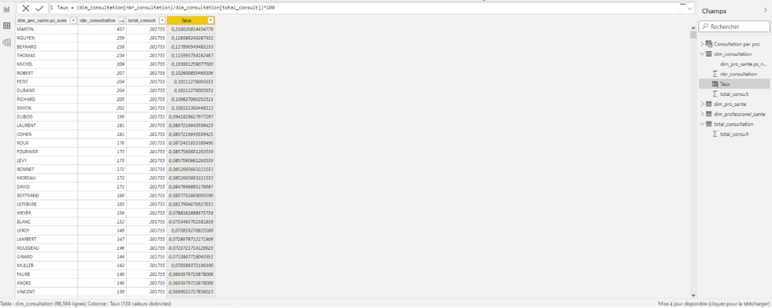

# BigData_CHU: Scripts pour la création et le chargement de données dans les tables

Tout d’abord, depuis Hive (avec l'interface Hue) qui se situe dans la VM Cloudera, on crée la base de données « bigdata_project ». 

## Création des tables externes

Ensuite, on crée les tables externes, on définit les colonnes ainsi que le délimiteur. À partir des jobs réalisés sur « TALEND », on peut importer le contenu du HDFS dans la base de données.

<p align="center">
 
 <br> <em> Création de la table dim_consultation </em>
</p>

Exemples de script pour créer d'autre tables:

### Exemple avec la dimension satisfaction

```SQL
    CREATE EXTERNAL TABLE dim_satisfaction(sas_id_finess int, sas_score_all_ajust float)
    PARTITIONED BY (sas_region string)
    ROW FORMAT DELIMITED
    FIELDS TERMINATED BY ",";
    STORED AS TEXTFILE
    LOCATION "/user/hive/data";
```

## Utilisation d'une view

Enfin, on a décidé de réaliser une vue pour notre table « fact_resultat » car cela nous permet de gagner du temps sur l’écriture de requêtes, mais aussi de centraliser toutes les informations importantes dans une simple table virtuelle.
```SQL
    CREATE VIEW vfait_resultat AS

    SELECT
    dim_patient_part.pat_id_patient AS id_patient,
    dim_professionel_sante.ps_id as id_professionnel_sante
    dim_etablissement_sante.eta_id_organisation as id_etablissement_sante,
    dim_consultation.con_id as id_consultation,
    dim_diagnostic.dia_code as id_diagnostic,
    dim_hospitalisation.hos_id as d_hospitalisation

    FROM dim_patient_part, dim_consultation, dim_etablissement_sante, dim_diagnostic, dim_hospitalisation, dim_professionel_sante, dim_deces_part, dim_satisfaction

    WHERE
    
    dim_patient_part.pat_id_patient = dim_consultation.con_1d_patient
    and dim_patient_part.pat_id_patient = dim_hospitalisation.hos_id_patient

    and dim_diagnostic.dia_code = dim_consultation.con_code_diag

    and dim_diagnostic.dia_code = dim_hospitalisation.hos_code_diagnostic

    and dim_professionel_sante.ps_id = dim_consultation.con_id_prof_sante

    and dim_etablissement_sante.eta_id_organisation = dim_professionel_sante.ps_id_org

    and dim_satisfaction.sas_id_finess = and dim_etablissement_sante.eta_finesse_etablissement_juridique;
```

<p align="center">
 
 <br> <em> Aperçu de la vue créée </em>
</p>

## Partionnement et bucketing

### Etape 1

Le partitionnement et le bucketing sont deux méthodes utilisées pour optimiser les performances des requêtes dans le traitement de Big Data. Ils sont généralement utilisés dans des systèmes comme Hadoop Hive qui sont conçus pour manipuler de grandes quantités de données.

Tout d’abord, on crée des tables externes de partionnement pour ne pas compromettre les données stockées dans notre HDFS.
Ensuite, on désigne la colonne que l’on veut partitionner et bucketer. 

<p align="center">
 
 <br> <em> Partionnement selon sexe car valeur binaire (male et female) donc 2 tableaux </em>
</p>

<p align="center">
 
 <br> <em> Partionnement selon région car valeurs limitées et non susceptibles d'augmenter avec le temps (moins de tableaux de partion) </em>
</p>

### Etape 2

Après avoir construit l’architecture de notre table, on insère les données de table d’origine dans notre nouvelle table partitionnée.

<p align="center">
 
 <br> <em> Insertion des données </em>
</p>

### Etape 3

On vérifie si notre partitionnement est valide.

<p align="center">
 
 <br> <em> 2 nouvelles partitions donc OK </em>
</p>

<p align="center">
 
 <br> <em> Plusieurs partitions en fonction du nombre des régions donc OK </em>
</p>

## Evaluation de la performance

On peut observer une différence de temps conséquente entre nos tables « dim_patient » et « dim_patient_part ».

<p align="center">
 
 <br> <em> Une réduction de l'ordre de 100 ! </em>
</p>

De même pour « dim_deces » et « dim_deces_part ».

<p align="center">
 
 <br> <em> De même: une réduction de l'ordre de 100 ! </em>
</p>

## Visualisation de données

Nombre de décès par localisation (région) sur l’année 2019:

<p align="center">
 
 <br> <em> Requête sous Hive </em>
</p>

<p align="center">
 
 <br> <em> Graphe décès par région: on observe la tendance que les régions les plus denses présentent le nombre le plus important de décès </em>
</p>

Taux de consultation par professionnel:

<p align="center">
 
 <br> <em> Importation sous PowerBI </em>
</p>

<p align="center">
 
 <br> <em> On observe une proportion de consultations par professionnel assez distribuée apart pour un cas </em>
</p>

